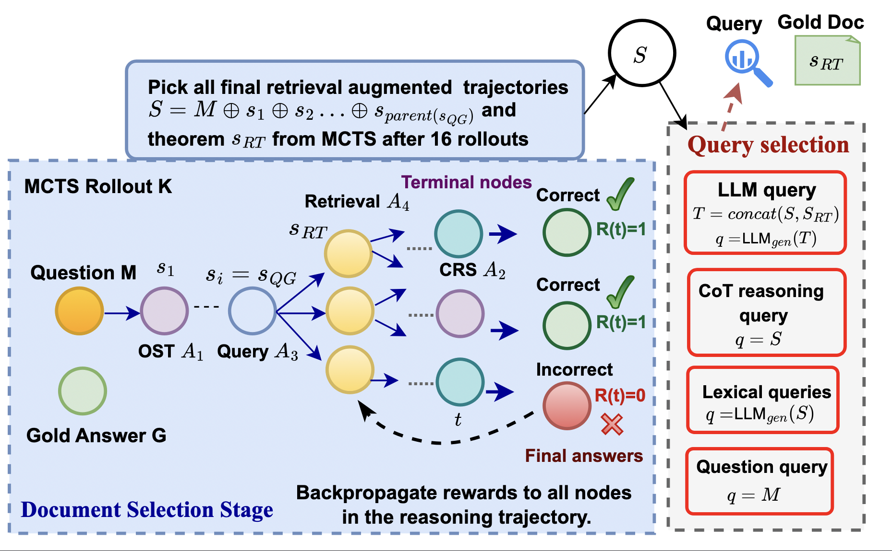
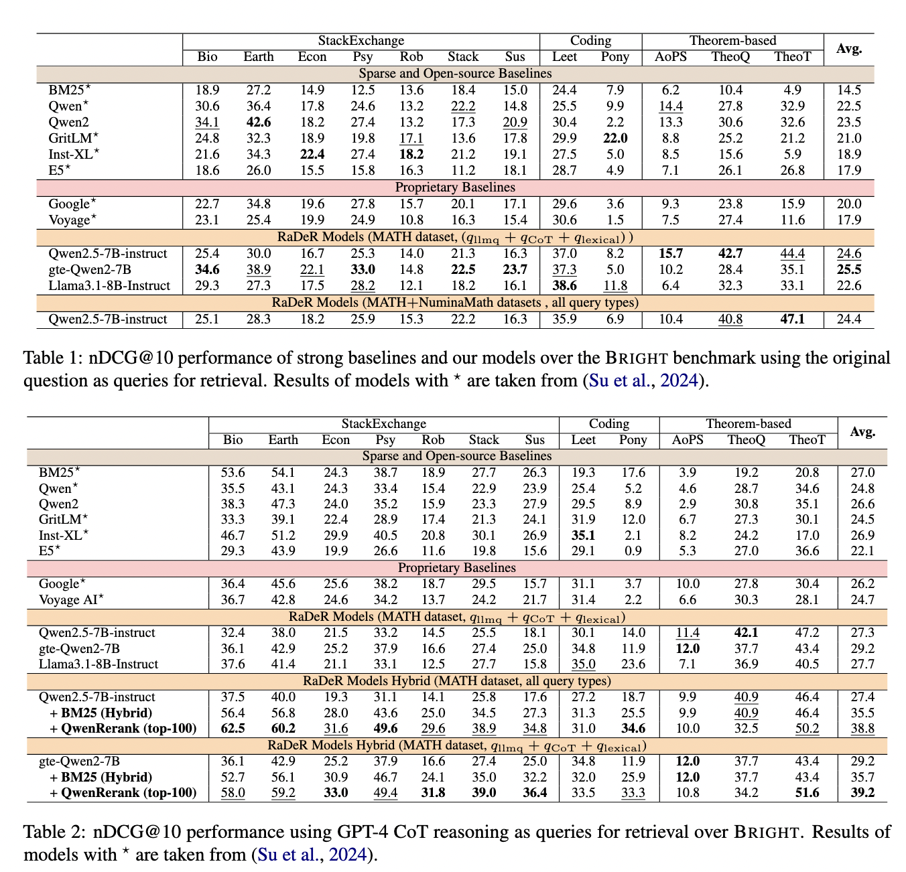
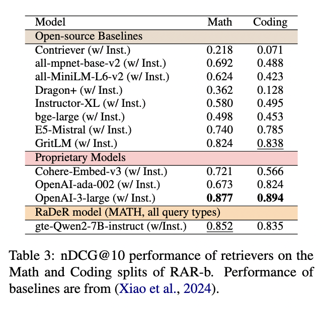
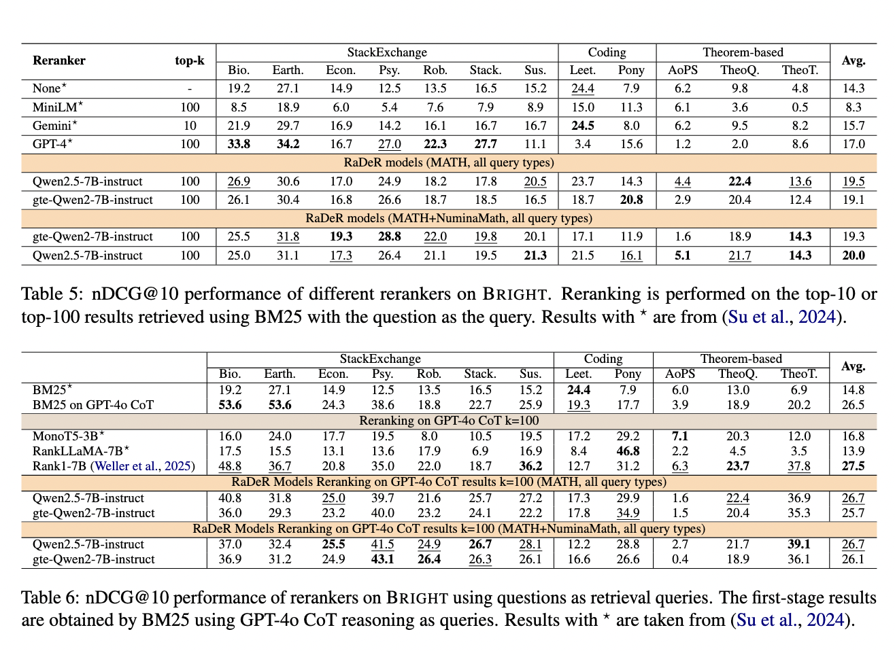

# RaDeR: Reasoning-aware Dense Retrieval Models

## Table of Contents 
1. [Overview](#overview)  
2. [Installation](#installation)  
   - [Make python environment](#make-python-environment)  
   - [Set the environment variables](#set-the-environment-variables)  
   - [Precompute document embeddings](#precompute-document-embeddings) 
3. [Retrieval data generation](#retrieval-data-generation)  
   - [Generate reasoning paths from MCTS](#generate-reasoning-paths-from-MCTS)  
4. [Generating queries](#generating-queries) 
   - [Generating LLM queries](#generating-llm-queries) 
   - [Generating lexical queries](#generating-lexical-queries) 
5. [Training models](#training-models)  
6. [Evaluating models](#evaluating-models)  
7. [Evaluation results](#evaluation-results)  

## Overview 
We propose RaDeR, a set of reasoning-based dense retrieval models trained with data derived from mathematical problem solving using large language models (LLMs). Our method leverages retrieval-augmented reasoning trajectories of an LLM and self-reflective relevance evaluation, enabling the creation of both diverse and hard-negative samples for reasoning-intensive relevance. RaDeR retrievers, trained for mathematical reasoning, effectively generalize to diverse reasoning tasks in the BRIGHT and RAR-b benchmarks, consistently outperforming strong baselines in overall performance.

<p align="center">
  <br>
  <em>Figure 1: Data generation pipeline for RaDeR.The OST action stands for one step thought generation, and CRS stands for complete remaining solution steps action.</em>
</p>

## Installation

### Make python environment

```shell
#Create a python environment with version 3.12.3. 
python -m venv RaDeR_env
source RaDeR_env/bin/activate
pip install -r requirements.txt
```

### Set the environment variables
Then set up the necessary API keys and other environment variables in the `.env` file.

#### Set up Huggingface credentials
```shell
HUGGINGFACE_CACHE_DIR=""      # Local path to huggingface cache
HUGGING_FACE_HUB_TOKEN=""     # Huggingface token
HF_HOME=""                    # Local path to huggingface cache 
```

#### Set up OpenAI credentials (Only if using OpenAI models)
```
AZURE_OPENAI_ENDPOINT=""
AZURE_OPENAI_API_KEY=""
```
#### Set up Huggingface Repllama path
```shell
REPLLAMA_MERGED_HUGGINGFACE_PATH=""    # Path to Repllama huggingface merged model
```

#### Set the RaDeR huggingface path (if using in MCTS) 
```shell
RaDeR_MERGED_HUGGINGFACE_PATH=""       # Path to RaDeR huggingface merged model
```
### Precompute document embeddings
Before setting the path to the stored Repllama doc embeddings, we need to compute the doc embeddings and store in ```BRIGHT_cache``` directory. We can precompute the embeddings of the document corpus of any splits of the BRIGHT dataset (with any retriever supported in vLLM). For the MCTS data generation pipeline, we need the doc embeddings of TheoremQA theorems corpus using RepLLama. 

#### For using the RepLLama model with the path you provided in ```.env``` execute: 
``` 
bash get_doc_embeddings.sh RepLLama   
```
And set the path to the stored RepLLama doc embeddings in the ```.env``` file. 
```shell
REPLLAMA_THEOREMT_DOC_EMB_CACHE="BRIGHT_cache/doc_emb/RepLLama/0.npy"    # Path to cache for Theoremqa Theorems BRIGHT repllama doc embeddings
```

#### For using the trained RaDeR model with the path you provided in ```.env``` execute: 
``` 
bash get_doc_embeddings.sh RaDeR    
```

## Retrieval data generation
We generate training data using a retrieval-augmented Monte Carlo Tree Search (MCTS) approach to solve mathematical reasoning problems using LLMs. Our motivation is twofold. First, solving mathematical problems often requires applying theorems to subproblems, which enables the integration of retrievers. Theorems found to be relevant to subproblems are also relevant to the original question due to the reasoning steps that connect them. Second, verifying LLM answers against gold answers provides a proxy for evaluating the utility of retrieved theorems in solving subproblems.

### Generate reasoning paths from MCTS
Follow the commands in ```run_MCTS.sh``` file to execute the data generation process by generating retrieval-augmented reasoning paths guided by rewards based on final answer correctness.  

First run the commands to start the retriever servers BM25 and RepLlama/RaDeR:  

****Start BM25 server****: ```python models/BM25_server_API.py > BM25_server.log 2>&1 &```  
****Start RepLlama server****:  ```./servers/repllama_server.sh > servers/RepLLama_server.log 2>&1 &```  
****Start RaDeR server****:  ```./servers/rader_server.sh RaDeR/merged_retriever_Qwen-2.5-7B-Instruct_MATH_questionpartialsol_and_LLMquery_full > servers/RaDeR_server.log 2>&1 &```


Example command to run the MCTS pipeline with parallel processing:
```shell
# Command to run MCTS on MATH dataset with Qwen2.5-7B-instruct and Repllama
python run_src/run_parallel_workers.py \
    --dataset_name MATH \
    --test_json_filename shuffled_train \
    --api vllm-server \
    --model_ckpt Qwen/Qwen2.5-7B-Instruct \
    --note TEST_MCTS_MATH_repllama \
    --retriever repllama \
    --max_depth_allowed 6 \
    --num_a1_steps 2 \
    --num_rollouts 16 \
    --disable_a5 \
    --save_tree \
    --disable_a3 \
    --disable_a4 \
    --bool_goldanswer_reward \
    --LLM_candidate_theorems \
    --num_workers 10 \
    --retrieval_selfreasoning \
    --run_outputs_root outputs_MCTS/run_outputs \
    --cache_dir BRIGHT_cache/doc_emb/RepLLama \
    --num_cpu 16
```  

**Important parameters for MCTS run:** 
```shell
--retriever                # Retriever choices: RaDeR/repllama
--LLM_candidate_theorems   # Whether to use LLM candidate theorems prompt
--bool_goldanswer_reward   # Use rewards based on final answer correctness to guide MCTS
--retrieval_selfreasoning  # Whether to use self-reflection on the retrieved document
--dataset_name             # Which math reasoning dataset to use for MCTS
--test_json_filename       # Name of the json file in the dataset directory to use
```  
> [!NOTE]
> We use the [*Rstar*](https://github.com/zhentingqi/rStar): Mutual Reasoning Makes Smaller LLMs Stronger Problem-Solvers github repository as the foundation for our MCTS data generation pipeline. 


## Generating queries 

### Generating LLM queries 
We prompt an LLM to generate query based on the math question M, the reasoning steps up to the query node (excluding the query),and the retrieved theorem. Assuming `outputs_MCTS/run_outputs/MATH/TEST_RUN/answer_sheets` is the path to your MCTS answer directory, use the following command:
```
python generate_LLMqueries.py --answers_directory_path outputs_MCTS/run_outputs/MATH/TEST_RUN/answer_sheets --model_ckpt Qwen/Qwen2.5-7B-Instruct --dataset_name MATH
```
### Generating lexical queries
We generate queries that have high term similarity with their respective relevant theorems, we prompt LLM using only the theorem from the MCTS. We provide helper code to generate these queries assuming you have the path to a csv file with a *input* column containing the retrieved theorem. Uncomment the code in the main function of ```vLLM_server_API.py``` and run the following command:
```
bash generate_lexicalqueries.sh
```
> [!NOTE]
> First, you need to make a csv file where there is a column called ```input``` containing the theorem from MCTS. ```generate_LLMqueries.py``` shows how to extract the theorems from MCTS.

## Training models
For training the our RaDeR retrievers and rerankers, we use the [Tevatron](https://github.com/texttron/tevatron) github, which is a software for training billion-scale LLM neural retriever on GPUs and TPUs. We use its functionality for Parameter efficient tuning with LoRA. It is integrated with vLLM, DeepSpeed, FlashAttention, gradient accumulation, and other efficient training and inference techniques.

**Installation**

0. Clone the Tevatron repository.  
2. Install PyTorch based on your CUDA version from [PyTorch](https://pytorch.org/get-started/locally/).  
3. Install dependencies and Tevatron.  

   
```bash
pip install transformers datasets peft
pip install deepspeed accelerate
pip install faiss-cpu
pip install -e .
```

**Run training** 

Example command for Retriever training:

```bash
deepspeed --include localhost:0,1 --master_port 60000 --module tevatron.retriever.driver.train \
  --deepspeed deepspeed/ds_zero3_config.json \
  --output_dir retriever-mistral \
  --model_name_or_path Qwen/Qwen2.5-7B-Instruct \
  --lora \
  --lora_target_modules q_proj,k_proj,v_proj,o_proj,down_proj,up_proj,gate_proj \
  --save_steps 500 \
  --dataset_name RaDer/MATH_allquery_types \
  --query_prefix "Query: " \
  --passage_prefix "Passage: " \
  --bf16 \
  --pooling eos \
  --append_eos_token \
  --normalize \
  --temperature 0.01 \
  --per_device_train_batch_size 2 \
  --gradient_checkpointing \
  --train_group_size 12 \
  --learning_rate 1e-4 \
  --query_max_len 32 \
  --passage_max_len 3900 \
  --num_train_epochs 1 \
  --logging_steps 10 \
  --overwrite_output_dir \
  --gradient_accumulation_steps 16
```

## Evaluating models
(1) For evaluation of retrievers on the **BRIGHT** dataset run the ```retriever_evaluation.sh``` with the correct arguments. Example command shown in the file.

(2) For evaluation of rerankers on the **BRIGHT** dataset run the ```reranker_evaluation.sh``` with the correct arguments. Example command shown in the file.


## Evaluation results

### Retrieval results of RaDeR models on BRIGHT 
<p align="center">
  <br>
</p>

### Retrieval results of RaDeR models on RAR-B Math and coding 
<p align="center">
  <br>
</p>

### Reranking results of RaDeR models on BRIGHT 
<p align="center">
  <br>
</p>

> [!NOTE]
> The score files from our two best performing RaDeR models with Qwen-32B-Instruct reranking is provided in the ```BRIGHT_score_files``` directory.